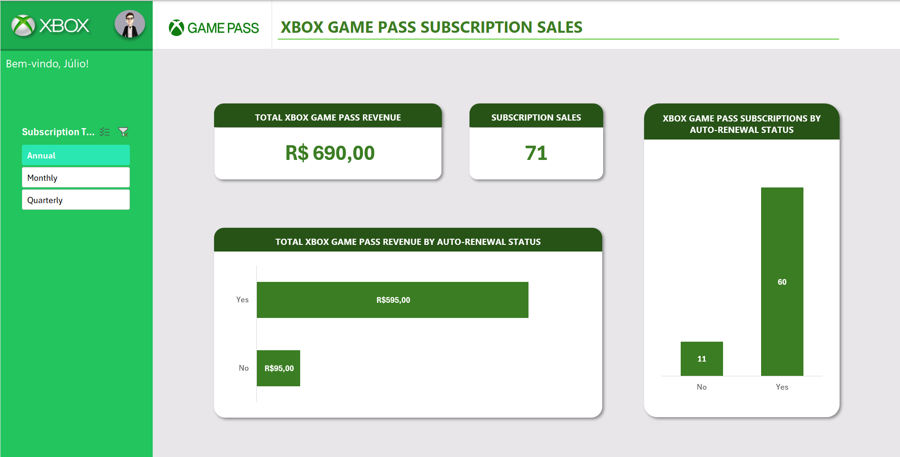
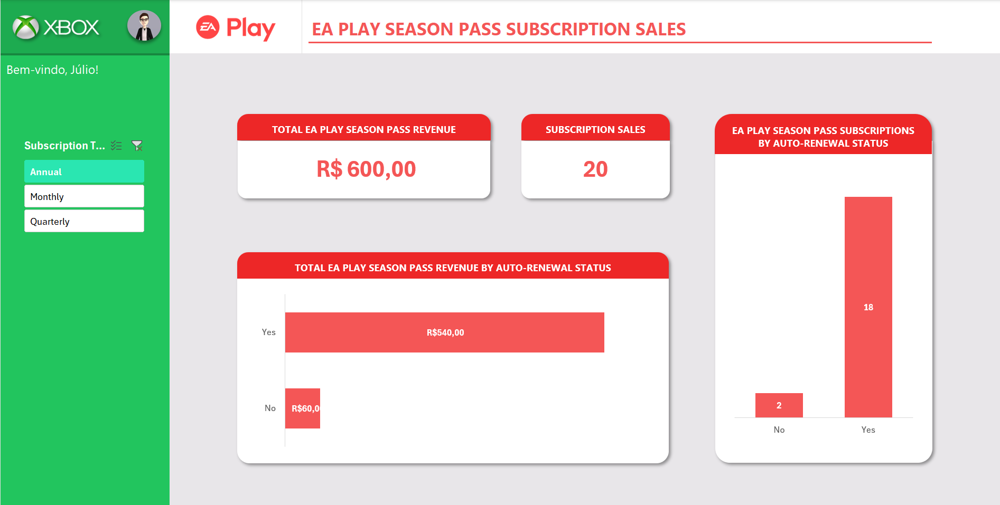
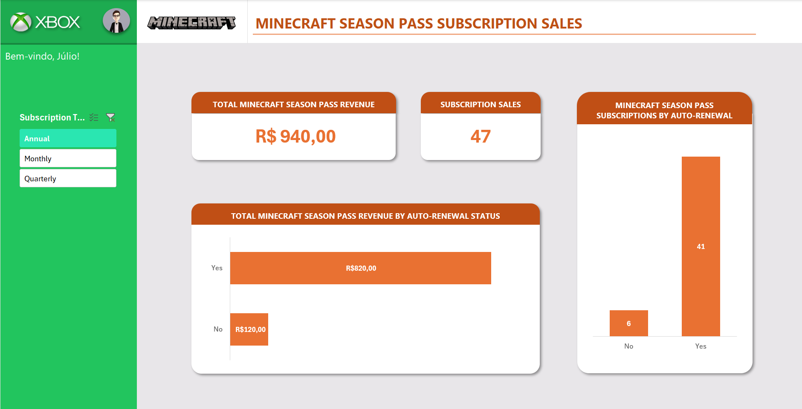

# DashBoard de Vendas do Xbox Game Pass com Excel

Esse projeto consiste na elaboração de um Dashboard de vendas do Xbox Game Pass. Ele foi desenvolvido durante o curso **"Análise de Dados com Excel e Copilot"** da **Digital Innovation One (DIO)**. O projeto teve como inspiração o projeto final desenvolvido no curso, porém, com aperfeiçoamentos que considerei importantes, como a adição de novas informações e Dashboards.

## Sumário
- [Objetivo do Dashboard](#objetivo-do-dashboard)
- [Imagens dos Dashboards](#imagens-dos-dashboards)
- [A base de dados](#a-base-de-dados)
- [Organização Geral](#organizacao-geral)
- [Instruções de Reprodução](#instrucoes-de-reproducao)
- [Tecnologias Utilizadas](#tecnologias-utilizadas)
- [Possíveis Análises](#possiveis-analises)

## Objetivo do Dashboard
O Dashboard foi desenvolvido para permitir a análise de vendas do Xbox Game Pass e de seus conteúdos adicionais, permitindo visualizar:

* Receita total por tipo de assinatura (mensal, trimestral ou anual)
* Número total de assinaturas vendidas por tipo de assinatura
* Receita total por status de auto-renovação
* Receita total de cada Season Pass
* Número total de assinaturas de cada Season Pass

Entre outras informações.

Seu objetivo é fornecer uma interface agradável e intuitiva para visualização gráfica de informações, permitindo assim uma análise mais facilitada e visual das informações extraídas da base de dados.

## Imagens dos Dashboards

  
Clique para expandir

  
  ### Xbox Game Pass Dashboard
  
  
  ### EA Play Season Pass Dashboard
  
  
  ### Minecraft Season Pass Dashboard
  

## A base de dados

  
Clique para expandir

  A base de dados utilizada para a criação do Dashboard foi a mesma utilizada pelo tutor na realização do exemplo de **Desafio de Projeto** do curso e segue o seguinte padrão:
  
  |Subscriber ID|Name|Plan|Start Date|Auto Renewal|Subscription Price|Subscription Type|EA Play Season Pass|Ea Play Season Pass Price|Minecraft Season Pass|Minecraft Season Pass Price|Coupon Value|Total Value|
  |---|---|---|---|---|---|---|---|---|---|---|---|---|
  |3231|João Silva|Ultimate|01/01/2024|Yes|R$ 15,00|Monthly|Yes|R$ 30,00|Yes|R$ 20,00|R$ 5,00|R$ 60,00| 

  

## Organização Geral

  
Clique para expandir

  O projeto foi diretamente inspirado no exemplo fornecido pelo tutor em aula, porém, ao contrário do exemplo em que foi criado somente um Dashboard, esse projeto foi dividido com o intuito de fornecer três Dashboards:
  
  * **Game Pass Dashboard** - Traz informações sobre as vendas do serviço de assinatura _Xbox Game Pass_ diretamente.
  
  * **EA Play Dashboard** - Traz informações sobre as vendas do serviço de assinatura _EA Play Season Pass_.
  
  * **Minecraft Dashboard** - Traz informações sobre as vendas do serviço de assinatura _Minecraft Season Pass_.
  
  Cada um desses Dashboards foi alocado em uma planilha (worksheet) dentro da pasta de trabalho do Excel (workbook) para melhor visualização e entendimento. Vale ressaltar que cada Dashboard conta também com estilização única para diferenciação. 
  
  # 
  
  Assim como ensinado pelo tutor, foram criadas outras três planilhas (worksheets) para organização de dados e que, por não terem a necessidade de serem expostas ao usuário final, foram ocultadas. São elas as seguintes:
  
  * **Assets** - Responsável por armazenar e organizar os elementos visuais utilizados nos Dashboards: Paleta de cores, imagens, etc.
  
  * **Bases** - Contém a base de dados da qual foram extraídas as informações dos Dashboards.
  
  * **Cálculos** - Contém o "processamento" dos dados: planilhas dinâmicas responsáveis por filtrar, ordenar e organizar as informações que serão disponibilizadas em cada Dashboard.

## Instruções de Reprodução

  
Clique para expandir

  
  ### 1. Fazer o Download do arquivo
  
  Basta fazer o Download da Pasta de Trabalho Excel (.xlsx) disponível nesse repositório e abri-la utilizando o software Microsoft Excel.
  
  Caso não possua familiaridade com o GitHub e não saiba como baixar um arquivo [Clique aqui](https://google.com) e assista o vídeo, nele é explicado como realizar esse procedimento passo a passo.
  
  ### 2. Como utilizar a Dashboard
  
  Após instalado e aberto (via Microsoft Excel) o arquivo mencionado, você verá uma dashboad interativa em sua tela. Para navegar pelas dashboards é bem simples:
  
  #### Filtro
  A esquerda da tela haverá um filtro interativo, ao selecionar o tipo de assinatura (Subscription Type) o Dashboard atualizará automaticamente os gráficos e informações.
  
  #### Outros Dashboards
  Para acessar os outros Dashboard ("EA Play Dashboad" e "Minecraft Dashboard"), basta navegar no menu situado na parte inferior da tela entre as diferentes planilhas.
  
  #### Planilhas ocultas
  Caso deseje ver o conteúdo das planilhas ocultas siga o passo a passo abaixo:
  
  1. Posicione o mouse em cima do nome de uma planilha no menu inferior e clique com o botão direito do mouse.
  2. Clique em "Reexibir" no menu suspenso que aparecerá.
  3. Selecione quais planilhas ocultas deseja reexibir (caso queira selecionar mais de uma, segure a tecla "Ctrl" e clique em todas que deseja).
  4. Clique em "ok".
  5. Pronto, as tabelas ocultas agora devem estar visíveis para você no menu inferior da tela.

## Tecnologias Utilizadas

  
Clique para expandir

  * Microsoft Excel
  * Tabelas Dinâmicas
  * Gráficos Dinâmicos
  * Segmentação de dados (slicers)

## Possíveis Análises

  
Clique para expandir

  Com o Dashboard é possível realizar as seguintes análises (entre muitas outras):
  
  * Qual plano gera mais receita
  * O impacto da renovação automática nas vendas
  * Quanto os Season Passes contribuem para o faturamento
  * Identificação de padrões de compra de usuários

